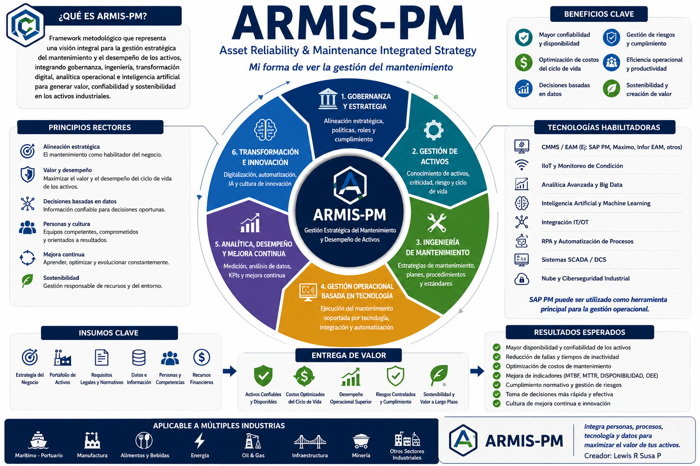

  

# ARMIS

## Asset Reliability & Maintenance Integrated Strategy

### Professional Technical Portfolio

---

ARMIS (**Asset Reliability & Maintenance Integrated Strategy**) is an integrated professional framework ecosystem designed to support organizations in maximizing asset performance, operational excellence and long-term business value.

The project combines **asset management, strategic maintenance, reliability engineering, operational technology (OT), industrial analytics, governance and artificial intelligence** into a unified methodology for industrial organizations.

Rather than focusing only on maintenance execution, ARMIS promotes a strategic vision where assets are managed throughout their entire lifecycle, aligning engineering decisions with business objectives, sustainability and digital transformation.

The ecosystem is intended to serve as both a **professional reference framework** and a **technical portfolio**, bringing together methodologies, practical tools, templates, dashboards, case studies and engineering best practices.

---

# Contents

- [Description](#description)
- [Why ARMIS?](#why-armis)
- [Vision](#vision)
- [ARMIS Ecosystem](#armis-ecosystem)
- [Domains](#domains)
- [Repository Structure](#repository-structure)
- [Roadmap](#roadmap)
- [About the Creator](#about-the-creator)

---

# Description

ARMIS provides an integrated engineering approach for organizations seeking to improve maintenance performance, asset reliability, operational efficiency and strategic decision-making.

The framework combines internationally recognized engineering practices with modern digital technologies, allowing organizations to move from traditional maintenance management toward intelligent, data-driven asset management.

Its modular architecture enables each framework to be implemented independently or as part of a complete ecosystem, depending on the organization's maturity level and business objectives.

---

# Why ARMIS?

Current industrial maintenance methodologies often concentrate on operational execution while treating strategic planning, asset management, digital transformation and engineering analytics as independent disciplines.

This fragmentation frequently leads to disconnected information, duplicated efforts, inconsistent decision-making and limited visibility across the asset lifecycle.

ARMIS was created to address this challenge by integrating engineering, governance, operational technology, business intelligence and artificial intelligence into a unified professional ecosystem.

Instead of viewing maintenance as an isolated operational function, ARMIS positions it as a strategic business capability capable of generating measurable value throughout the entire lifecycle of industrial assets.

---

# Vision

To become an internationally recognized professional ecosystem for asset management, maintenance engineering, reliability, operational excellence and digital transformation, providing practical methodologies that help organizations maximize asset value through engineering, innovation and data-driven decision making.

---

# ARMIS Ecosystem
| Framework | Focus Area | Status | Description |
|----------|------------|--------|-------------|
| ARMIS-PM | Performance Management | ✅ Available | Strategic framework for maintenance management, asset performance, reliability and digital transformation. |
| ARMIS-AM | Asset Management | 🚧 In Development | Framework focused on asset lifecycle management, criticality and value optimization. |
| ARMIS-RM | Reliability Management | 🚧 In Development | Framework for reliability engineering, failure analysis, RCA, FMEA and continuous improvement. |
| ARMIS-AI | Artificial Intelligence | 🚧 In Development | AI-oriented framework for predictive maintenance, decision support and intelligent automation. |
| ARMIS-OT | Operational Technology | 📅 Planned | Framework for OT environments, industrial systems, IIoT, SCADA and IT/OT integration. |
| ARMIS-GRC | Governance, Risk & Compliance | 📅 Planned | Framework for governance, risk management, compliance and operational resilience. |
| ARMIS-RISK | Operational Risk Management | 📅 Planned | Framework focused on operational risks, asset risks, continuity and decision-making. |

---

# Domains

ARMIS integrates multiple engineering, operational and digital domains into a unified professional ecosystem.

| Domain | Scope |
|--------|-------|
| Asset Management | Asset lifecycle, criticality, value optimization and strategic alignment. |
| Maintenance Engineering | Preventive, predictive, corrective and condition-based maintenance. |
| Reliability Engineering | RCA, FMEA, MTBF, MTTR, availability, maintainability and failure analysis. |
| Operational Excellence | Process optimization, standardization, continuous improvement and performance management. |
| Industrial Analytics | KPIs, dashboards, operational intelligence, Power BI and data-driven decisions. |
| Digital Transformation | Digital workflows, automation, CMMS/EAM, ERP integration and Industry 4.0. |
| Artificial Intelligence | Predictive maintenance, intelligent recommendations, automation and decision support. |
| Operational Technology | SCADA, IIoT, sensors, industrial networks and IT/OT integration. |
| Risk Management | Operational risk, asset risk, continuity, resilience and compliance. |

---

# Roadmap

The ARMIS Professional Framework Ecosystem is being developed as a long-term engineering initiative. Each framework contributes a specialized domain while maintaining interoperability across the complete ecosystem.

| Phase | Deliverable | Status |
|------|-------------|:------:|
| Phase 1 | Repository initialization and project architecture | ✅ Completed |
| Phase 2 | ARMIS Main Repository (Documentation & Landing Page) | ✅ Completed |
| Phase 3 | ARMIS-PM Framework (Performance Management) | 🚧 In Progress |
| Phase 4 | ARMIS-AM Framework (Asset Management) | 📅 Planned |
| Phase 5 | ARMIS-RM Framework (Reliability Management) | 📅 Planned |
| Phase 6 | ARMIS-RISK Framework (Operational Risk Management) | 📅 Planned |
| Phase 7 | ARMIS-GRC Framework (Governance, Risk & Compliance) | 📅 Planned |
| Phase 8 | ARMIS-OT Framework (Operational Technology & Industry 4.0) | 📅 Planned |
| Phase 9 | ARMIS-AI Framework (Artificial Intelligence for Asset Performance) | 📅 Planned |
| Phase 10 | Templates, Dashboards and Engineering Toolkits | 📅 Planned |
| Phase 11 | Industrial Case Studies and Best Practices | 📅 Planned |
| Phase 12 | Technical Publications and Professional Guides | 📅 Planned |

---

### Long-Term Objectives

- Develop a complete professional engineering framework ecosystem.
- Integrate international best practices in maintenance and asset management.
- Publish practical methodologies supported by real industrial scenarios.
- Build reusable templates, dashboards and engineering toolkits.
- Incorporate Artificial Intelligence into maintenance decision-making.
- Promote operational excellence through data-driven engineering.
- Create an open technical knowledge base for engineers and organizations worldwide.

---

# Repository Structure

ARMIS
│
├── Frameworks
│   ├── ARMIS-PM
│   ├── ARMIS-AM
│   ├── ARMIS-RM
│   ├── ARMIS-AI
│   ├── ARMIS-OT
│   ├── ARMIS-GRC
│   └── ARMIS-RISK
│
├── Images
│   ├── ARMIS-PM.png
│   └── README.md
│
├── Publications
│
├── Dashboards
│
├── Templates
│
├── Case-Studies
│
├── Presentations
│
├── Resources
│
├── LICENSE
└── README.md

---

## About the Creator

**Lewis Rafael Susa Peñate**

Industrial Engineer
Systems Engineer
Information Security Specialist

Creator of the ARMIS Professional Framework Ecosystem, focused on integrating maintenance, asset management, reliability, digital transformation, operational technology, risk management and artificial intelligence into practical engineering methodologies.
