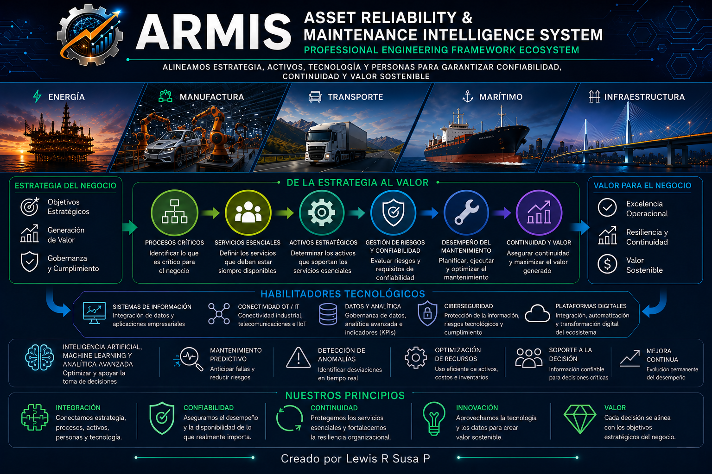

<p align="center">
  
</p>

# ARMIS

## Asset Reliability & Maintenance Intelligence System

### Professional Engineering Framework Ecosystem

> **Integramos estrategia, procesos críticos, servicios esenciales, activos, riesgos, tecnología e inteligencia artificial para generar valor sostenible.**


---

## Bienvenido a ARMIS

ARMIS (**Asset Reliability & Maintenance Intelligence System**) es un **Professional Engineering Framework Ecosystem** diseñado para integrar disciplinas de ingeniería que tradicionalmente han evolucionado de manera independiente, proporcionando un marco metodológico para alinear la estrategia organizacional con la gestión de procesos críticos, servicios esenciales, activos, riesgos, continuidad operacional, tecnología e inteligencia artificial.

Más que una metodología de mantenimiento o una plataforma tecnológica, ARMIS constituye un marco de ingeniería orientado a fortalecer la capacidad de las organizaciones para cumplir su misión mediante la generación sostenible de valor.

---

# ¿Por qué nace ARMIS?

Las organizaciones actuales operan en entornos donde personas, procesos, activos, información y tecnología interactúan de manera permanente.

Sin embargo, muchas metodologías continúan abordando estos elementos de forma independiente, generando silos de información, esfuerzos duplicados y decisiones desconectadas de la estrategia empresarial.

ARMIS nace para ofrecer una visión integrada de la ingeniería, en la que todas las disciplinas contribuyen a un mismo propósito: apoyar el cumplimiento de los objetivos estratégicos mediante la gestión coordinada de los recursos organizacionales.

---

# Nuestra visión

Consolidar un ecosistema internacional de ingeniería que permita integrar estrategia, gestión de activos, confiabilidad, continuidad, calidad, tecnología, analítica e inteligencia artificial dentro de un único Framework, proporcionando metodologías abiertas, escalables e independientes de plataformas tecnológicas.

---

# El modelo conceptual ARMIS

La filosofía del Framework se fundamenta en la siguiente relación de valor:

```text
Misión Organizacional
        │
        ▼
Objetivos Estratégicos
        │
        ▼
Procesos Críticos
        │
        ▼
Servicios Esenciales
        │
        ▼
Activos Estratégicos
        │
        ▼
Gestión Integrada
        │
 ├── Riesgos
 ├── Confiabilidad
 ├── Mantenimiento
 ├── Tecnología
 ├── Calidad
 ├── Continuidad
 ├── Analítica
 └── Inteligencia Artificial
        │
        ▼
Valor para el Negocio
```

---

# Dominios de Ingeniería

ARMIS integra conocimientos provenientes de múltiples disciplinas:

| Dominio                     | Propósito                                                                    |
| --------------------------- | ---------------------------------------------------------------------------- |
| Ingeniería Industrial       | Gestión de procesos, operaciones, activos y desempeño.                       |
| Ingeniería de Sistemas      | Arquitectura empresarial, sistemas de información e integración tecnológica. |
| Redes de Telecomunicaciones | Conectividad entre personas, procesos, activos y tecnologías.                |
| Seguridad Informática       | Protección de la información y resiliencia tecnológica.                      |
| Gestión de Activos          | Optimización del ciclo de vida de los activos.                               |
| Gestión del Riesgo          | Identificación y tratamiento integral de riesgos.                            |
| Continuidad del Negocio     | Protección de los servicios esenciales.                                      |
| Ciencia de Datos            | Transformación de datos en conocimiento.                                     |
| Inteligencia Artificial     | Apoyo avanzado para la toma de decisiones.                                   |

---

# Ecosistema ARMIS

El ecosistema evolucionará mediante módulos especializados que compartirán una filosofía y arquitectura comunes.

| Módulo   | Estado           |
| -------- | ---------------- |
| ARMIS-PM | 🚧 En desarrollo |
| ARMIS-AM | 📅 Planificado   |
| ARMIS-RM | 📅 Planificado   |
| ARMIS-CM | 📅 Planificado   |
| ARMIS-CS | 📅 Planificado   |
| ARMIS-AI | 📅 Planificado   |
| ARMIS-DA | 📅 Planificado   |
| ARMIS-OT | 📅 Planificado   |

---

# Documentación Oficial

La documentación del proyecto se encuentra organizada de forma jerárquica.

| Documento            | Propósito                                                  |
| -------------------- | ---------------------------------------------------------- |
| ARMIS_PHILOSOPHY.md  | Filosofía, postulados, axiomas y principios del Framework. |
| ARMIS_MASTER_PLAN.md | Dirección estratégica y hoja de ruta del proyecto.         |
| README.md            | Presentación oficial del ecosistema.                       |

---

# Estado del Proyecto

ARMIS se encuentra actualmente en la fase de consolidación de su arquitectura conceptual y documental.

Los siguientes hitos ya han sido alcanzados:

* ✅ Filosofía de Ingeniería ARMIS.
* ✅ Plan Maestro del Proyecto.
* 🚧 Desarrollo del Framework ARMIS-PM.
* 📅 Arquitectura metodológica.
* 📅 Implementación tecnológica.

---

# Hoja de Ruta

La evolución del proyecto seguirá una estrategia incremental:

1. Consolidación del Framework.
2. Desarrollo metodológico.
3. Desarrollo de módulos especializados.
4. Implementación tecnológica.
5. Integración con plataformas empresariales.
6. Incorporación de analítica avanzada.
7. Integración de inteligencia artificial.
8. Consolidación del ecosistema ARMIS.

---

# Tecnologías del Ecosistema

La futura implementación tecnológica podrá integrar plataformas como:

* SAP PM
* IBM Maximo
* Power BI
* Python
* PostgreSQL
* Docker
* FastAPI
* Inteligencia Artificial
* IIoT
* Plataformas OT

La selección tecnológica siempre estará subordinada a la filosofía y metodología del Framework.

---

# Cómo comenzar

Si es la primera vez que visitas el proyecto, el recorrido recomendado es:

1. Leer el presente README.
2. Revisar **ARMIS_PHILOSOPHY.md**.
3. Consultar **ARMIS_MASTER_PLAN.md**.
4. Explorar los Frameworks especializados.

---

# Autor

**Lewis Rafael Susa Peñate**

Ingeniero Industrial

Ingeniero de Sistemas

Especialista en Seguridad Informática

Creador del ecosistema **ARMIS – Professional Engineering Framework Ecosystem**.

---

# Licencia

Este proyecto se distribuye bajo la licencia MIT.
